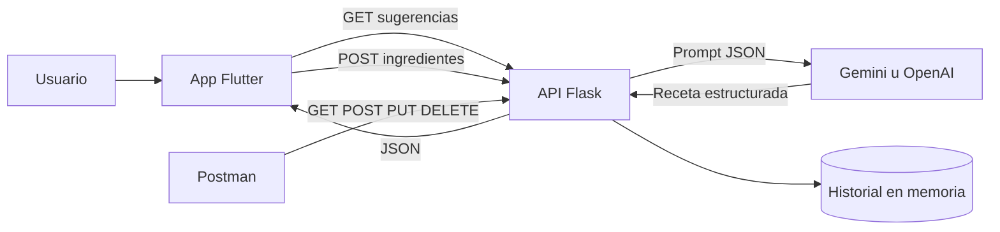

# EcoEat Chef Virtual Anti Desperdicio

Proyecto del examen parcial de Programación Móvil e integración con Inteligencia Artificial. EcoEat permite registrar ingredientes disponibles, obtener sugerencias y generar una receta de aprovechamiento desde una app Flutter conectada a un backend Flask.

## Arquitectura



- **Flutter:** captura ingredientes, consume GET y POST, convierte JSON a objetos Dart y muestra estados de carga y error.
- **Flask:** valida solicitudes, integra Gemini u OpenAI y mantiene un historial en memoria.
- **Modo demo:** si no hay clave o la IA falla, entrega una receta local para que la demostración siga funcionando.
- **Postman:** cubre los cuatro métodos HTTP solicitados con validaciones automáticas.

## Endpoints

| Método | Ruta | Payload | Respuesta exitosa |
|---|---|---|---|
| GET | `/api/ingredientes/sugeridos` | Ninguno | `200` lista `ingredientes` |
| POST | `/api/receta/generar` | `{"ingredientes": ["arroz", "tomate"]}` | `201` objeto `receta` |
| PUT | `/api/historial/favorito` | `{"id": 1, "favorito": true}` | `200` receta actualizada |
| DELETE | `/api/historial/<id>` | Ninguno | `200` confirmación e id |
| GET | `/api/historial` | Ninguno | `200` historial actual |
| GET | `/health` | Ninguno | `200` estado del servicio |

## Ejecutar el backend

Requiere Python 3.10 o superior.

```bash
cd backend
python -m venv .venv
```

En Windows:

```powershell
.venv\Scripts\Activate.ps1
pip install -r requirements.txt
Copy-Item .env.example .env
python run.py
```

En macOS o Linux:

```bash
source .venv/bin/activate
pip install -r requirements.txt
cp .env.example .env
python run.py
```

Para usar IA real, edita `.env` y agrega `GEMINI_API_KEY` o selecciona `AI_PROVIDER=openai` y agrega `OPENAI_API_KEY`. Nunca subas el archivo `.env`.

Ejecuta las pruebas desde `backend`:

```bash
python -m unittest discover -s tests -v
```

## Ejecutar Flutter

El directorio `frontend` incluye los proyectos nativos para Android e iOS, además de soporte web. Instala las dependencias:

```bash
cd frontend
flutter pub get
```

Para Android Emulator, la URL predeterminada ya es `http://10.0.2.2:5000`:

```bash
flutter run
```

Para web, iOS Simulator o un backend remoto:

```bash
flutter run --dart-define=API_BASE_URL=http://localhost:5000
```

En un dispositivo físico usa la IP local del computador, por ejemplo `http://192.168.1.20:5000`, y permite el acceso en el firewall si corresponde.

## Probar con Postman

1. Inicia el backend en el puerto 5000.
2. Importa `postman/EcoEat.postman_collection.json`.
3. Ejecuta la colección en orden. El request POST guarda automáticamente `recipeId` para las pruebas PUT y DELETE.

## Estructura

```text
backend/     API Flask, integración de IA y pruebas
frontend/    UI Flutter, modelo Dart y cliente HTTP
postman/     Colección de pruebas de la API
```

## Decisiones de resiliencia

- Validación de tipos, duplicados y límite de ingredientes.
- Tiempo máximo en llamadas de red y mensajes de error visibles en la app.
- Fallback local si Gemini u OpenAI no están configurados o fallan.
- Bloqueo del almacenamiento en memoria para evitar escrituras simultáneas inconsistentes.
- Claves y entornos locales excluidos mediante `.gitignore`.

